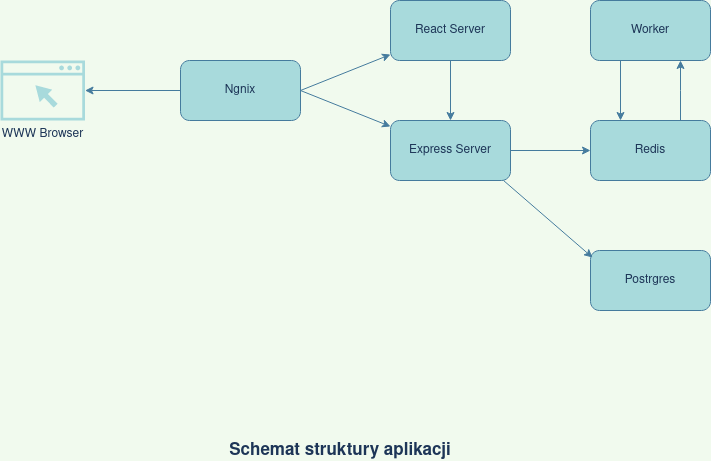
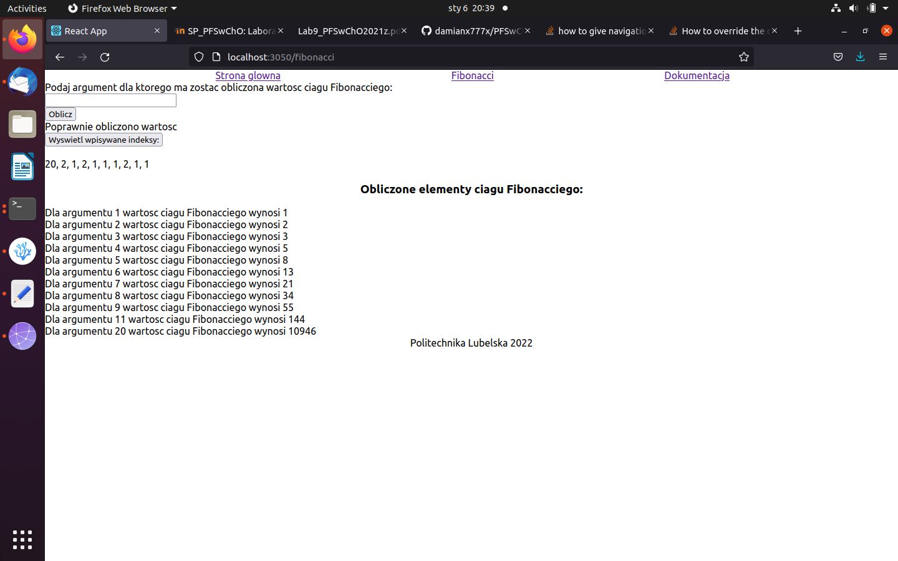

<h1> Dokumentacja wykonania projektu </h1>  
      

        <h3>Opis aplikacji</h3> 
        Niniejsza aplikacja powstala w celu prezentacji mozliwosci budowy aplikacji za pomoca wykorzystania mikroserwisow bedacych konteneremi Dockera. Aplikacja dziala w wersji deweloperskiej, wiec zmiany wprowadzone w plikach zrodlowych aplikacji sa natychmiast widoczne w serwisie. Zadaniem aplikacji jest obliczanie wartosci ciagu Fibonacciego. Uzytkownik wpisuje wartosc indeksu (od 1 do 20, przedzial obustronnie domkniety) dla ktorego ma zostac obliczona wartosc ciagu Fibonacciego. Aplikacja zapisuje juz obliczone wartosci, a takze oferuje zapis historii wprowadzanych argumentow. 

       
       

      <h3>Uruchomienie aplikacji</h3>
      W celu uruchomienia aplikacji prosze pobrac pliki z repozytorium (np. za pomoca narzedzia git lub w formiacie zip i rozpakowac). Nastepnie w terminalu przejsc do folderu projektu i wydac polecenie: 
      
      
        COMPOSE_HTTP_TIMEOUT=300 docker-compose up
  
Pierwsza czesc polecenia jest czasami konieczna ze wzgledu wolnego uruchamiania sie kontenera client_1. Ewentualnie nalezy uruchomic polecenie drugi raz. Serwis dostepny jest pod adresem localhost:3050. Poniezej zrzut ekranu potwierdzajacy uruchomienie aplikacji.
    

  

 

  <h3>Architektura aplikacji</h3>
     Aplikacja sklada sie z nastepujacych kontenerow: 
         <ul>
           <li><b>Ngnix</b> - Pelni funkcje proxy. Pierwszy element aplikacji na drodze komunikacji z przegladarka internetowa uzytkownika.</li>
           <li><b>React Server</b> - Odpowiada za tworzenie interfejsu uzytkownika i sama strukture serwisu. </li>
           <li><b>Express Server</b> - Pelni funkcje API umozliwiajacego kontakt z serwisami Postgres oraz Redis.</li>
           <li><b>Postgres</b> - Baza danych zawierajaca dane o historii wprowadzanych indeksow.</li>
           <li><b>Redis</b> - Przechowuje wyniki obliczen do wyswietlenia w postaci par klucz - wartosc.</li>
           <li><b>Worker</b> - Nadzoruje oraz przeprowadza operacje na elementach ciagu Fibonacciego na rzecz kontenera Redis.</li>
                      </ul>

      

        <h3>Zmiany wzgledem laboratorium 9</h3>  
    Aplikacja zostala stworzona na podstawie kodu zrodlowego z laboratorium nr 9. W celu realizacji zadania dokonano nastepujacych zmian w kodzie aplikacji:
<ul>
        <li>W pliku package.json dla kontenera React Server ustawiono skrypt startowy jako  "start": "react-scripts --openssl-legacy-provider start"
          z powodu faktu iz Dockerfile dla kontenera oparty jest na najnowszej wersji Node.js. Wersje od 17 wzwyz powoduja problemy z OpenSSL. Najproszym sposobem na obejscie problemu jest uruchomienie skryptow kontenera z wyzej opisana opcja zgodnosci.
</li>
        <li>
          W pliku Fib.js zmieniono sposob wyswietlania wpisanych przez uzytkownika indeksow. Teraz nie sa one automatycznie aktualizowane po obliczeniu wartosci ciagu Fibonacciego dla okreslonego elementu. Zamiast tego 10 ostatnio wprowadzonych wartosci indeksow zostaje wyswietlone po nacisnieciu przycisku historia. Wyswietlone indeksy nie aktualizuja sie automatycznie, konieczne jest kazdorazowe nacisniecie przycisku historia. Indeksy sa uporzadkowane od najnowszego do najstarszego.
</li>
        <li>
          W tym samym pliku wprowadzono walidajce pola tekstowego w ktorym uzytkownik podaje indeks. Jezeli uzytkownik nie poda popranej liczby calkowitej z zakresu od 1 do 20 zostanie wyswietlony komunikat, a serwer nie wykona polaczenia z api.
</li>
<li>W pliku index.js serwera Express Server dokonano modyfikacji rozkazu tworzacego tabele w kontenerze Postgres. Dodano kolumne id zwierajaca autoinkrementowane indeksy sluzace do wydobywaniu na ich podstawie ostatnich 10 argumentow wpisanych przez uzytkownika.</li>
<li>W tym samym pliku zmieniono maksymalna wartosc argumentu ciagu Fibonacciego na 20.</li>
<li>Zmodyfikowano zapytanie SQL bedace czescia obslugi adresu "/values/all" tak by odpowiadalo funkcjonalnosci wyswietlania historii wpisywanych indeksow. SQL: "SELECT * from values order by id desc limit 10".</li>
<li>Poprawiono plik Fib.js. W poprzedniej wersji pliku indeksy oraz wartosci wyswietlaly sie dopiero po recznym odswiezeniu strony przez uzytkownika. Po poprawkach nie jest konieczne przeladowanie strony przez uzytkownika, wykonanie obliczen takze odbywa sie bez koniecznosci przeladowania strony przez przegladarke.</li>
<li>Stworzono plik Home.js ze strona startowa serwisu.</li>
<li>Stworzono plik Documentation.js wraz z plikami graficznymi dla kontenera React Server. Plik Documentation.js zawiera sprawozdanie z realizacji projektu.</li>
<li>Dodano kilka zasad CSS (plik App.css) w celu przejrzystego wyswietlania strony. Zrezygnowano z domyslnego motywu Reacta poniewaz wyswietlal sie on w sposob niepoprawny z elementami serwisu. </li>
</ul>

